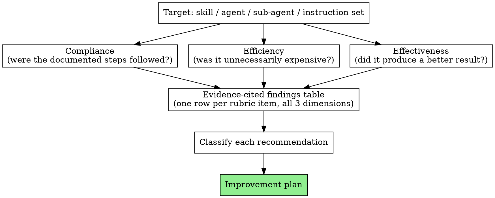

# Process Skill Auditor

Process-oriented skills, agent definitions, and instruction sets document
concrete rules for how they're supposed to be executed: which model tier
for which subtask, when to batch instead of splitting dispatches, how many
fix-loop rounds before escalating, how much a controller should narrate,
which artifacts get handed over as files instead of pasted into context.
Those rules get followed loosely in practice — nobody re-reads the fine
print mid-session. Separately, even a technically-compliant execution can
be needlessly expensive, or compliant-and-cheap but ineffective at the one
thing that mattered.

This skill audits a real session against a real target (skill, agent,
sub-agent, or instruction set) across three distinct questions, kept
distinct because a session can pass one and fail another:



**Not this skill:** extracting the user's own stated preferences or
feedback for memory — that's `extract-session-preferences`, which mines the
*user's* words for durable behavioral instructions. This skill mines the
*execution* (tool calls, dispatches, context passed, rounds taken) against
a *target's own documented rules*. They read the same kind of input (a
transcript) but answer different questions. A finding here
("the controller reread the plan 8 times") is an execution observation,
not automatically a user preference — see Step 7 for the one narrow,
gated path between the two.

## Audit Boundary

This skill evaluates two related but separate questions:

1. **Execution quality** — was the target used correctly and efficiently
   in this session?
2. **Target quality** — is the target's own documented process itself
   appropriate?

Execution quality is the primary subject of this skill. A target-quality
finding requires stronger evidence than an execution finding: do not infer
that a skill, agent, or instruction set should change merely because it
was inconvenient, expensive, or deviated from in one session. Step 4 below
exists specifically to keep these two questions from collapsing into each
other.

## Step 1: Identify the target and the session

Confirm both before doing anything else, asking the user if either is
ambiguous:

- **The target.** A skill (`SKILL.md` + any prompt templates/scripts it
  references), an agent or sub-agent definition, or an instruction set
  (a CLAUDE.md section, a project's own house rules doc). Locate its
  actual source file(s) — don't audit from memory of what it probably
  says.
- **The session(s).** "That session" is often ambiguous across a user's
  history — Claude Code session logs live under each project's directory
  in the local `projects/` tree, one `.jsonl` per session, with any
  spawned-subagent transcripts in a sibling `<session-id>/subagents/`
  folder. A target's name alone matches far too many sessions to
  disambiguate by content (skill/agent listings appear in nearly every
  session's system prompt whether or not they were actually used) —
  narrow by project, rough time frame, or ask directly rather than
  guessing from a keyword search.

If the transcript doesn't fully cover the session (compaction, an
in-progress run, a portion you couldn't access), say so up front and scope
every verdict to what was actually visible.

## Step 2: Derive three rubrics from the target's own documented process

Read the target's full text. Pull out concrete, checkable rules — not
vibes — and sort them into the three dimensions. A rule belongs wherever
its pass/fail condition actually lives; some rules only make sense in one
dimension.

### Establish the task baseline first

Before judging efficiency or proportionality, classify the audited task's
approximate complexity and risk:

- **LOW** — small, localized, low-risk change
- **MEDIUM** — multi-file or moderately complex change
- **HIGH** — broad architectural, production, data, security, or
  high-impact work

Base this on the task's actual scope, dependencies, risk, and required
correctness — not on how many files or agents the execution happened to
use (that's the thing being judged, not the input to the judgment).
Efficiency and effectiveness findings are relative to this baseline: ten
agents and multiple review rounds on a HIGH-risk change may be exactly
right, and one agent skipping review on a HIGH-risk change is a finding
regardless of how fast it was. Do not call a process "over-engineered"
merely because it used many steps — check whether those steps were
justified by the baseline first.

**Compliance** — did execution follow what's documented?

- Required steps performed; forbidden steps avoided
- Model-selection rules followed
- Batching/dispatch-granularity rules followed
- Required context/package handed to sub-agents (brief files, diff
  packages, global constraints) actually used
- Delegation boundaries respected (e.g. "sub-agents never spawn their own
  sub-agents")
- State-tracking discipline (ledgers, progress files, correct resumption)

**Efficiency** — even where compliant, was it unnecessarily expensive? A
session's biggest costs are rarely in its smallest operations, so split
this into four layers and look at each:

*Context efficiency:*

- Context accumulated turn after turn well past what the current task needs
- Repeated reads of the same large source (a plan, a spec, a big file)
  instead of targeted excerpts
- A full document handed to a sub-agent when an excerpt would do
- Context duplicated between the parent session and what it hands a
  sub-agent
- A session continued past a natural boundary where compacting or
  clearing would have reset an inflated context cheaply
- An oversized prompt for the task at hand

*Agent efficiency:*

- Whether a sub-agent was necessary at all, given the task's size and the
  baseline
- Whether the assigned model was proportionate (see Model Efficiency,
  below)
- Whether the task was too small to justify delegation overhead
- Whether multiple agents duplicated the same work
- Whether a dispatched agent received more context than its task needed
- Whether a general-purpose agent was used where a narrower, cheaper one
  would have done as well
- Whether spawn depth or agent count was justified by the work, not just
  available

  **Model Efficiency** (the usual biggest lever inside agent efficiency):
  where the model for a dispatch is visible, judge it against the task's
  complexity, required reasoning depth, context needs, ambiguity, and
  consequence of failure — mechanical, well-specified work needs less than
  ambiguous or high-stakes judgment work. Flag a dispatch where a
  substantially cheaper model would likely have sufficed. Do not flag one
  merely because the task *looks* simple on the surface, and never treat
  model price alone as proof of inefficiency — on a HIGH-baseline task, the
  cost of a wrong answer usually dwarfs the price gap between tiers.

*Process efficiency:*

- Redundant validation or review rounds
- Unnecessary narration between steps
- Serial work with no dependency forcing it to be serial
- Redundant tool calls, or re-running work a report already covered
- Duplicated information living in more than one place (ledger, brief, and
  transcript all saying the same thing)

*Session efficiency:*

- Whether the session boundary was appropriate for the work — including
  whether staying in one long-running session was intentional and
  justified by the target process, not merely long. If the work stayed in
  one session because the target process itself requires continuity (e.g.
  subagent-driven-development's whole design is staying in one session to
  avoid context-switch cost), that's not a finding — do not recommend
  splitting a session merely because it ran long if the target process
  intentionally requires continuity.
- Whether a background or looped process kept running after its useful
  work was already done
- Whether compacting should have happened earlier, or clearing should have
  been used when switching to an unrelated task
- Whether a long-running session accumulated context from work unrelated
  to what it's currently doing
- Whether an ongoing process was a deliberate choice or simply left running

### Cost hierarchy

Not all inefficiency carries equal weight — one unnecessary grep is close
to irrelevant next to an unnecessary Opus dispatch plus 150k of avoidable
context plus three redundant review rounds. When findings compete for
attention in the report, prioritize roughly in this order:

1. Unnecessary long-running or background sessions
2. Excessive context accumulation
3. Unnecessary or excessive sub-agent usage
4. Inappropriate model selection for the delegated task
5. Redundant agent or review rounds
6. Repeated large-file or artifact reads
7. Redundant tool calls
8. Minor narration or formatting overhead

The goal is a meaningful reduction in token usage and process overhead, not
minimizing every individual operation — don't let a report full of small
tool-call nitpicks bury the one session-architecture finding that actually
mattered.

### Reason from this session's own numbers, not generic thresholds

Usage-pattern diagnostics ("sessions active 8+ hours," "context over
150k," "subagent-heavy sessions") describe where cost concentrates across
a user's *overall* usage — they're why Efficiency has four layers instead
of one flat list, not per-session thresholds to check a transcript
against. A 184k-context session isn't a finding by itself; "70k of the
184k came from rereading the same plan five times" is. Decompose a
session's own numbers into their sources before judging them, and let a
worked finding — "the context is not inherently a problem; however, 70k of
it came from X, which was avoidable" — stand in the report instead of a
bare comparison against an imported percentage.

**Effectiveness** — did the process produce a materially better result?

- Did it catch issues that mattered, or would a lighter process have
  caught the same ones?
- Did extra rounds materially change the outcome, or converge to the same
  answer at extra cost?
- Did sub-agents receive enough context to actually succeed, or did
  under-provisioning cause avoidable back-and-forth?
- Were the right things delegated — was a reviewer/sub-agent given work
  that actually needed its judgment, or busywork?
- Was the process's weight proportionate to the task baseline established
  above?
- What was the marginal value of each additional agent, review round, or
  context expansion? Walk the sequence (round 1 found N real defects,
  round 2 found M, round 3 found none, ...) and name where the returns
  dropped off — see Cost-to-value assessment, below, for how to weigh this.

### Cost-to-value assessment

For any expensive operation flagged in Efficiency, or any round evaluated
under Effectiveness's marginal-value question, weigh its cost against what
it actually bought:

- What additional information did it obtain?
- What defect or risk did it actually discover — or would plausibly have
  discovered, on a HIGH-baseline task, even if it came up empty?
- Could a cheaper operation have obtained the same information?
- Could the same validation have happened earlier, before more expensive
  work built on an unverified assumption?
- Did it materially change the implementation or a decision?
- Would removing it meaningfully increase risk, given the task baseline?

A costly operation is not inefficient merely because it was expensive — a
thorough review on a HIGH-risk change earns its cost. A successful
operation is not automatically worthwhile just because it found
something — if a cheaper path would have found the same thing, the
expensive path is the real finding. Prefer the cheapest process that gives
sufficient confidence for the task's actual risk level, not the cheapest
process in isolation.

Turn each surviving rule into a numbered rubric item, phrased so it can be
graded PASS / VIOLATION / PARTIAL / CAN'T DETERMINE against transcript
evidence. A target with no concrete process rules in a given dimension —
e.g. a target with nothing that speaks to effectiveness — simply has fewer
rows there; don't force a rubric item out of a dimension the target's text
doesn't address.

## Step 3: Delegate the transcript mining

Session transcripts, especially ones with spawned sub-agents, are
routinely multi-megabyte across many files. Check file sizes first. When
they're large, do not load the full transcript or full set of sub-agent
transcripts directly into your own context — dispatch a background agent
to do the mining instead, which keeps your context free for the interview
and final synthesis. For a small session (a short transcript, no spawned
sub-agents), direct inspection is fine and often faster than the overhead
of a dispatch — this skill exists to cut unneeded process, not add it
back in on the auditor's own side. Either way, hold whatever evidence you
gather to the standard in Self-Audit Integrity, below.

The dispatch prompt to that agent should contain:

- All three rubrics from Step 2, verbatim, numbered, dimension-labeled
- The task baseline (LOW/MEDIUM/HIGH) established in Step 2, so the mining
  agent judges proportionality against it rather than inventing its own
  sense of what the task warranted
- The transcript path(s), with a note on the JSONL log format if the agent
  hasn't seen one before (inspect the first ~20 lines to learn the schema
  before mining)
- An explicit instruction to grep/target-read rather than bulk-read, and to
  quote concrete evidence (approximate line number or timestamp, the
  offending message) for every non-PASS verdict, using the evidence-based
  cost-estimate rule from Step 6 — proxies, not invented token counts
- An explicit instruction NOT to propose rewrites to the target itself —
  its job is describing what happened, not judging whether the target's
  rules are well-designed
- The report format from Step 6, so the agent's return needs no reshaping

## Self-Audit Integrity

Rank evidence by how independently it can be verified, not by how
convenient it was to obtain:

- **Best** — independently retrievable primary evidence: file paths and
  line numbers, transcript timestamps, tool-call records, agent dispatch
  records.
- **Acceptable** — an authoritative session artifact that already
  consolidates evidence and can be cited by path: a ledger, a progress
  file, a saved report.
- **Lower confidence** — the auditor's own recollection or reasoning about
  what happened, unsupported by a citable artifact.
- **Avoid** — unsupported inference presented as if it were observed.

When the auditor is also the agent/controller whose execution is being
audited, disclose that explicitly in the report. Audit Boundary, above,
already splits execution quality from target quality; a self-audit adds a
third question underneath both — can the auditor's own account of its own
execution be trusted? — that needs its own answer, not a silent assumption.
Do not treat the auditor's memory or reasoning as equivalent to a citable
artifact merely because it turns out to be correct. For every non-PASS
finding, reach for the highest tier of evidence actually available — the
ledger, the diff, the dispatch record — before reasoning from recollection,
even when recollection is fresh and the auditor is confident. If nothing
above "lower confidence" is available for a finding, say so explicitly in
the evidence column and weight that finding accordingly, rather than
presenting it with the same confidence as a finding cited to a file and
line elsewhere in the same report.

This doesn't mean always delegating to a background agent — Step 3's
delegation exists to keep large transcripts out of the auditor's own
context, not to manufacture independence for its own sake. If the session
already produced a concise, authoritative ledger with exact evidence,
reading that ledger directly already satisfies the "Acceptable" tier
without the overhead of a redundant mining dispatch. Delegation is one way
to reach independently verifiable evidence; it is not the objective.

A self-audit condition does not invalidate a finding — it's an
evidence-quality limitation, not a disqualifying one — but it must be
disclosed whenever it's material to how much weight a finding should carry.

## Step 4: Adjudicate before recommending anything

A gap between the target's text and the transcript is not automatically a
defect in either the execution or the target. Before turning any finding
into a recommendation, work through this for each one:

1. **Was the target actually followed?** If yes, it's not a finding —
   move on, even if a more efficient path existed that the target's text
   didn't require.
2. **If not, was the deviation justified by the task?** A rule with a
   good reason to bend (a genuinely urgent exception, a case the rule's
   author likely didn't anticipate) is not automatically a violation to
   report as one — say so, and why.
3. **If unjustified, whose fault is it — the execution, or the target?**
   An execution that ignored a clear, sensible rule is an execution
   finding. A rule that's ambiguous, contradictory, or actively
   counter-productive for the task at hand is a signal about the target
   itself, not the session.
4. **If the target looks at fault, is there enough evidence to say so?**
   One session is weak evidence that a rule is wrong; say that plainly
   rather than recommending a change off a single data point.
5. **Even with evidence, is modifying the target allowed here?** Vendored
   or plugin-distributed targets often carry an explicit policy (e.g. the
   superpowers plugin's "no changes to tuned skill content without eval
   evidence"). Check for one before recommending a change to the target
   itself — if a policy exists, route the finding as an observation for a
   human to weigh, not a proposed edit.

## Step 5: Classify every recommendation

Every surviving finding gets exactly one classification — resist the urge
to hedge with two:

- **Skill/process improvement** — the target's own documented process
  should change. Only after Step 4 clears the target as actually at fault,
  with real evidence, and modification isn't blocked by policy.
- **Agent/instruction improvement** — a dispatched agent's prompt template
  or an instruction set (not the orchestrating skill itself) should
  change.
- **Global configuration improvement** — a standing, cross-project rule
  (CLAUDE.md-level) would prevent recurrence. Hold this to the same bar
  `extract-session-preferences` uses for GLOBAL scope: real, generalizable
  evidence, not a single incident dressed up as a rule.
- **Project-specific improvement** — relevant only to this project's
  setup, conventions, or constraints.
- **No change** — the deviation was justified (Step 4.2), or the cost was
  real but trivial relative to the task.
- **Observation** — worth monitoring but insufficient evidence to act on
  yet, or action is blocked by a modification policy (Step 4.5).

### Worked example: attributing a model-selection finding

The same visible symptom — an expensive model on a task that didn't need
it — routes to a different classification depending on where the decision
actually lived, so trace it back before recommending anything:

- The target's own rules mandate an expensive model regardless of task
  shape → **Skill/process improvement**, once Step 4 clears the target as
  actually at fault.
- A dispatched agent's own prompt template defaults to an expensive model
  regardless of what it's asked to do → **Agent/instruction improvement**.
- The target's model-selection rules are sound, but the controller picked
  an expensive model anyway on one dispatch → an execution finding, not a
  target-quality one. Classify it **No change** if isolated and cheap
  relative to the task, or **Project-specific improvement** /
  **Observation** if it's worth flagging — and let Step 7's gate handle it
  if the same choice keeps recurring across sessions.

Same surface symptom, three different root causes, three different fixes.

## Step 6: Report format

Keep it skimmable — this is meant to be acted on, not read as a narrative.
One table per dimension (Compliance / Efficiency / Effectiveness):

```text
| # | Rubric item | Verdict | Evidence | Est. cost |
|---|-------------|---------|----------|-----------|
| 1 | ...         | PASS / VIOLATION / PARTIAL / CAN'T DETERMINE | one sentence, cited | see below |
```

**Cost estimates must be evidence-based.** Use exact token counts only
when the transcript or run metadata actually reports them (e.g. a task
notification's `total_tokens`). Otherwise use observable proxies and label
them as such: characters/size of the pasted content, number of tool calls,
number of agent dispatches, number of review/fix rounds, number of repeated
reads of the same source, elapsed or waiting time where available. Do not
back into a token estimate from message length and present it as a number
— an unlabeled "~4,200 tokens wasted" invents precision the evidence
doesn't support; "3 full re-reads of a 61KB file" is the real finding.

Followed by a ranked improvement plan — every non-"No change" finding,
each with its Step 5 classification and a one-line "why it matters"
grounded in a specific rubric row.

Order the plan by each recommendation's expected impact, weighing:

1. Severity of the underlying problem
2. Likelihood of recurrence
3. Cost or risk the problem introduces
4. Expected benefit of the proposed fix
5. Effort or cost of implementing the fix

The ordering must stay consistent with the severity language used
elsewhere in the same report — if a lower-ranked item is described as
materially higher-impact than something ranked above it, either reorder
them or state the trade-off explicitly. A reader skimming top to bottom
should never find the report's own prose contradicting its own ranking.

## Step 7: The one gated path to extract-session-preferences

This skill's output is an improvement plan, not a memory-save flow, and it
must not auto-promote execution findings into user preferences — an
execution habit ("reread the plan 8 times") is not evidence about what the
*user* wants, only about what happened.

The one exception: if, across this audit or several, the same
**Global configuration improvement** keeps recurring for the same target
or pattern, that repetition is itself the kind of independent-moments
evidence `extract-session-preferences` requires to promote something to
GLOBAL scope. In that specific case — and only that case — surface it to
the user as a candidate ("this has now shown up in two audits — want me to
run extract-session-preferences on it, or save it directly?") rather than
saving it yourself. Everything else stays a report the user reads and acts
on manually.
